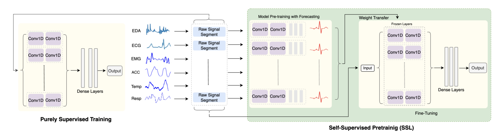
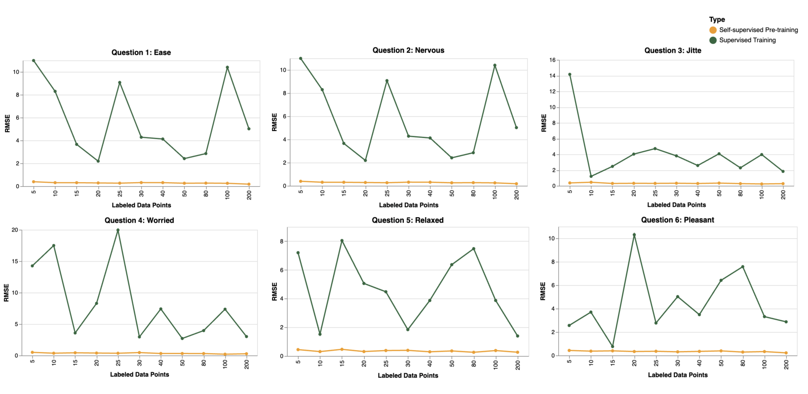

# Stress Prediction using Multimodal Wearable Data  

This repository explores **stress prediction from multimodal wearable signals** using **self-supervised learning (SSL)**.  
It shows how SSL can address subjectivity and sparse labeling in stress datasets, achieving improved accuracy with limited labeled data.  

---

## 📌 Project Overview  
- **Goal**: Predict stress from wearable sensor data while reducing dependence on large labeled datasets.  
- **Signals Used**: EDA, ECG, EMG, ACCELEROMETER, TEMP, RESP, and TEMPERATURE.  
- **Approach**:  
  - Pre-train models using **self-supervised objectives**.  
  - Fine-tune on small labeled subsets.  
  - Compare **SSL** vs. **purely supervised training**.  
- **Key Results**:  
  - Improved accuracy with only **5% labeled data**.  
  - Demonstrated scalability for **real-world stress monitoring**.  

---

---

## ⚙️ Methods  
- **Self-Supervised Pre-Training**: Built a pretext task to learn embeddings without labels.  
- **1D-CNN**: Used to capture temporal patterns in multimodal signals.  
- **Supervised Fine-Tuning**: Trained downstream predictors with as little as **5% labeled data**.  
- **Evaluation Metrics**: RMSE
- **Architecture**:
    

---

## 📊 Results  
 

### SSL vs. Supervised Training (Figure 7)  
  
*Comparison of supervised-only vs. SSL training. SSL consistently outperforms under sparse labeling.*  

---

## 🛠️ Tech Stack  
- **Languages**: Python  
- **Frameworks**: TensorFlow, PyTorch  
- **Libraries**: NumPy, Pandas, Matplotlib, Scikit-learn  

---

## 🚀 Key Contributions  
- Designed **SSL pipelines for multimodal wearable data**.  
- Built **1D-CNN stress prediction models** validated on datasets with 71 participants.  
- Achieved significantly low RMSE with only **5% labeled data**.  
- Created reproducible notebooks for **SSL vs. supervised comparisons**.  

